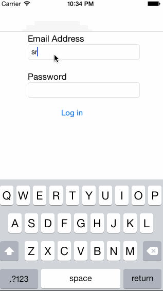

#Student Companion iOS Application

Student Companion help organize the information about Courses,
Universities, and Tasks (Assignment, Exams etc). Here are the
things a student can do:

  1. Register and Login to the application.
  2. View/Add/Edit the courses enrolled in.
  3. View/Add/Edit the Assignments, Exams, etc for each of the source.
  4. View/Add/Remiders for each of the assingment, exam, etc.
  5. View/List/Edit the information about the Universities for which
     the student wants to apply for.
  6. Save personal information like Full Name, Name of Program, Name of
     School and the Year of study.

# Demo
Here is the rough sketch of the application:

